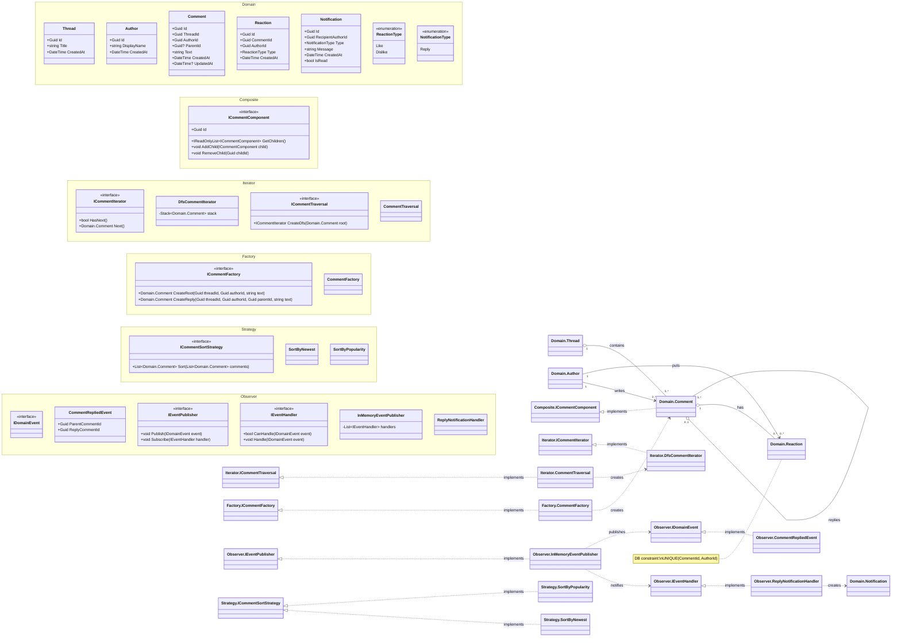

```mermaid
classDiagram
direction LR

namespace Domain {
  class Thread {
    +Guid Id
    +string Title
    +DateTime CreatedAt
  }

  class Author {
    +Guid Id
    +string DisplayName
    +DateTime CreatedAt
  }

  class Comment {
    +Guid Id
    +Guid ThreadId
    +Guid AuthorId
    +Guid? ParentId
    +string Text
    +DateTime CreatedAt
    +DateTime? UpdatedAt
  }

  class Reaction {
    +Guid Id
    +Guid CommentId
    +Guid AuthorId
    +ReactionType Type
    +DateTime CreatedAt
  }

  class Notification {
    +Guid Id
    +Guid RecipientAuthorId
    +NotificationType Type
    +string Message
    +DateTime CreatedAt
    +bool IsRead
  }

  class ReactionType {
    <<enumeration>>
    Like
    Dislike
  }

  class NotificationType {
    <<enumeration>>
    Reply
  }
}

namespace Composite {
  class ICommentComponent {
    <<interface>>
    +Guid Id
    +IReadOnlyList~ICommentComponent~ GetChildren()
    +void AddChild(ICommentComponent child)
    +void RemoveChild(Guid childId)
  }
}

namespace Iterator {
  class ICommentIterator {
    <<interface>>
    +bool HasNext()
    +Domain.Comment Next()
  }

  class DfsCommentIterator {
    -Stack~Domain.Comment~ stack
  }

  class ICommentTraversal {
    <<interface>>
    +ICommentIterator CreateDfs(Domain.Comment root)
  }

  class CommentTraversal
}

namespace Factory {
  class ICommentFactory {
    <<interface>>
    +Domain.Comment CreateRoot(Guid threadId, Guid authorId, string text)
    +Domain.Comment CreateReply(Guid threadId, Guid authorId, Guid parentId, string text)
  }

  class CommentFactory
}

namespace Strategy {
  class ICommentSortStrategy {
    <<interface>>
    +List~Domain.Comment~ Sort(List~Domain.Comment~ comments)
  }

  class SortByNewest
  class SortByPopularity
}

namespace Observer {
  class IDomainEvent {
    <<interface>>
  }

  class CommentRepliedEvent {
    +Guid ParentCommentId
    +Guid ReplyCommentId
  }

  class IEventPublisher {
    <<interface>>
    +void Publish(IDomainEvent event)
    +void Subscribe(IEventHandler handler)
  }

  class IEventHandler {
    <<interface>>
    +bool CanHandle(IDomainEvent event)
    +void Handle(IDomainEvent event)
  }

  class InMemoryEventPublisher {
    -List~IEventHandler~ handlers
  }

  class ReplyNotificationHandler
}

%% -------- Domain relationships --------
Domain.Thread "1" o-- "0..*" Domain.Comment : contains
Domain.Author "1" --> "0..*" Domain.Comment : writes
Domain.Comment "0..1" o-- "0..*" Domain.Comment : replies
Domain.Comment "1" o-- "0..*" Domain.Reaction : has
Domain.Author "1" --> "0..*" Domain.Reaction : puts

%% -------- Composite (tree structure) --------
Composite.ICommentComponent <|.. Domain.Comment : implements

%% -------- Iterator (tree traversal) --------
Iterator.ICommentIterator <|.. Iterator.DfsCommentIterator : implements
Iterator.ICommentTraversal <|.. Iterator.CommentTraversal : implements
Iterator.CommentTraversal ..> Iterator.DfsCommentIterator : creates

%% -------- Factory (creation) --------
Factory.ICommentFactory <|.. Factory.CommentFactory : implements
Factory.CommentFactory ..> Domain.Comment : creates

%% -------- Strategy (sorting) --------
Strategy.ICommentSortStrategy <|.. Strategy.SortByNewest : implements
Strategy.ICommentSortStrategy <|.. Strategy.SortByPopularity : implements

%% -------- Observer (notifications on reply) --------
Observer.IDomainEvent <|.. Observer.CommentRepliedEvent : implements
Observer.IEventPublisher <|.. Observer.InMemoryEventPublisher : implements
Observer.IEventHandler <|.. Observer.ReplyNotificationHandler : implements

Observer.InMemoryEventPublisher ..> Observer.IEventHandler : notifies
Observer.InMemoryEventPublisher ..> Observer.IDomainEvent : publishes
Observer.ReplyNotificationHandler ..> Domain.Notification : creates

note for Domain.Reaction "DB constraint:\nUNIQUE(CommentId, AuthorId)"
```
