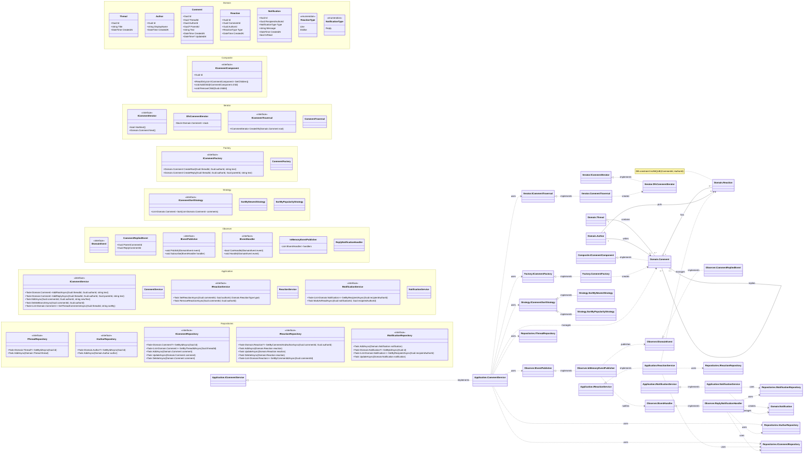

```mermaid
classDiagram
direction LR

namespace Domain {
  class Thread {
    +Guid Id
    +string Title
    +DateTime CreatedAt
  }

  class Author {
    +Guid Id
    +string DisplayName
    +DateTime CreatedAt
  }

  class Comment {
    +Guid Id
    +Guid ThreadId
    +Guid AuthorId
    +Guid? ParentId
    +string Text
    +DateTime CreatedAt
    +DateTime? UpdatedAt
  }

  class Reaction {
    +Guid Id
    +Guid CommentId
    +Guid AuthorId
    +ReactionType Type
    +DateTime CreatedAt
  }

  class Notification {
    +Guid Id
    +Guid RecipientAuthorId
    +NotificationType Type
    +string Message
    +DateTime CreatedAt
    +bool IsRead
  }

  class ReactionType {
    <<enumeration>>
    Like
    Dislike
  }

  class NotificationType {
    <<enumeration>>
    Reply
  }
}

namespace Composite {
  class ICommentComponent {
    <<interface>>
    +Guid Id
    +IReadOnlyList~ICommentComponent~ GetChildren()
    +void AddChild(ICommentComponent child)
    +void RemoveChild(Guid childId)
  }
}

namespace Iterator {
  class ICommentIterator {
    <<interface>>
    +bool HasNext()
    +Domain.Comment Next()
  }

  class DfsCommentIterator {
    -Stack~Domain.Comment~ stack
  }

  class ICommentTraversal {
    <<interface>>
    +ICommentIterator CreateDfs(Domain.Comment root)
  }

  class CommentTraversal
}

namespace Factory {
  class ICommentFactory {
    <<interface>>
    +Domain.Comment CreateRoot(Guid threadId, Guid authorId, string text)
    +Domain.Comment CreateReply(Guid threadId, Guid authorId, Guid parentId, string text)
  }

  class CommentFactory
}

namespace Strategy {
  class ICommentSortStrategy {
    <<interface>>
    +List~Domain.Comment~ Sort(List~Domain.Comment~ comments)
  }

  class SortByNewestStrategy
  class SortByPopularityStrategy
}

namespace Observer {
  class IDomainEvent {
    <<interface>>
  }

  class CommentRepliedEvent {
    +Guid ParentCommentId
    +Guid ReplyCommentId
  }

  class IEventPublisher {
    <<interface>>
    +void Publish(IDomainEvent event)
    +void Subscribe(IEventHandler handler)
  }

  class IEventHandler {
    <<interface>>
    +bool CanHandle(IDomainEvent event)
    +void Handle(IDomainEvent event)
  }

  class InMemoryEventPublisher {
    -List~IEventHandler~ handlers
  }

  class ReplyNotificationHandler
}

namespace Application {
  class ICommentService {
    <<interface>>
    +Task~Domain.Comment~ AddRootAsync(Guid threadId, Guid authorId, string text)
    +Task~Domain.Comment~ AddReplyAsync(Guid threadId, Guid authorId, Guid parentId, string text)
    +Task EditAsync(Guid commentId, Guid authorId, string newText)
    +Task DeleteBranchAsync(Guid commentId, Guid authorId)
    +Task~List~Domain.Comment~~ GetThreadCommentsAsync(Guid threadId, string sortBy)
  }

  class CommentService

  class IReactionService {
    <<interface>>
    +Task SetReactionAsync(Guid commentId, Guid authorId, Domain.ReactionType type)
    +Task RemoveReactionAsync(Guid commentId, Guid authorId)
  }

  class ReactionService

  class INotificationService {
    <<interface>>
    +Task~List~Domain.Notification~~ GetByRecipientAsync(Guid recipientAuthorId)
    +Task MarkAsReadAsync(Guid notificationId, Guid recipientAuthorId)
  }

  class NotificationService
}

namespace Repositories {
  class IThreadRepository {
    <<interface>>
    +Task~Domain.Thread?~ GetByIdAsync(Guid id)
    +Task AddAsync(Domain.Thread thread)
  }

  class IAuthorRepository {
    <<interface>>
    +Task~Domain.Author?~ GetByIdAsync(Guid id)
    +Task AddAsync(Domain.Author author)
  }

  class ICommentRepository {
    <<interface>>
    +Task~Domain.Comment?~ GetByIdAsync(Guid id)
    +Task~List~Domain.Comment~~ GetByThreadIdAsync(Guid threadId)
    +Task AddAsync(Domain.Comment comment)
    +Task UpdateAsync(Domain.Comment comment)
    +Task DeleteAsync(Domain.Comment comment)
  }

  class IReactionRepository {
    <<interface>>
    +Task~Domain.Reaction?~ GetByCommentAndAuthorAsync(Guid commentId, Guid authorId)
    +Task AddAsync(Domain.Reaction reaction)
    +Task UpdateAsync(Domain.Reaction reaction)
    +Task DeleteAsync(Domain.Reaction reaction)
    +Task~List~Domain.Reaction~~ GetByCommentIdAsync(Guid commentId)
  }

  class INotificationRepository {
    <<interface>>
    +Task AddAsync(Domain.Notification notification)
    +Task~Domain.Notification?~ GetByIdAsync(Guid id)
    +Task~List~Domain.Notification~~ GetByRecipientAsync(Guid recipientAuthorId)
    +Task UpdateAsync(Domain.Notification notification)
  }
}

Domain.Thread "1" o-- "0..*" Domain.Comment : contains
Domain.Author "1" --> "0..*" Domain.Comment : writes
Domain.Comment "0..1" o-- "0..*" Domain.Comment : replies
Domain.Comment "1" o-- "0..*" Domain.Reaction : has
Domain.Author "1" --> "0..*" Domain.Reaction : puts

Composite.ICommentComponent <|.. Domain.Comment : implements

Iterator.ICommentIterator <|.. Iterator.DfsCommentIterator : implements
Iterator.ICommentTraversal <|.. Iterator.CommentTraversal : implements
Iterator.CommentTraversal ..> Iterator.DfsCommentIterator : creates

Factory.ICommentFactory <|.. Factory.CommentFactory : implements
Factory.CommentFactory ..> Domain.Comment : creates

Strategy.ICommentSortStrategy <|.. Strategy.SortByNewestStrategy : implements
Strategy.ICommentSortStrategy <|.. Strategy.SortByPopularityStrategy : implements

Observer.IDomainEvent <|.. Observer.CommentRepliedEvent : implements
Observer.IEventPublisher <|.. Observer.InMemoryEventPublisher : implements
Observer.IEventHandler <|.. Observer.ReplyNotificationHandler : implements
Observer.InMemoryEventPublisher ..> Observer.IEventHandler : notifies
Observer.InMemoryEventPublisher ..> Observer.IDomainEvent : publishes
Observer.ReplyNotificationHandler ..> Domain.Notification : creates

Application.ICommentService <|.. Application.CommentService : implements
Application.IReactionService <|.. Application.ReactionService : implements
Application.INotificationService <|.. Application.NotificationService : implements

Application.CommentService ..> Repositories.IThreadRepository : uses
Application.CommentService ..> Repositories.IAuthorRepository : uses
Application.CommentService ..> Repositories.ICommentRepository : uses
Application.CommentService ..> Factory.ICommentFactory : uses
Application.CommentService ..> Strategy.ICommentSortStrategy : uses
Application.CommentService ..> Iterator.ICommentTraversal : uses
Application.CommentService ..> Observer.IEventPublisher : uses
Application.CommentService ..> Domain.Comment : manages

Application.ReactionService ..> Repositories.ICommentRepository : uses
Application.ReactionService ..> Repositories.IReactionRepository : uses
Application.ReactionService ..> Domain.Reaction : manages

Application.NotificationService ..> Repositories.INotificationRepository : uses
Application.NotificationService ..> Domain.Notification : manages

Observer.ReplyNotificationHandler ..> Repositories.ICommentRepository : uses
Observer.ReplyNotificationHandler ..> Repositories.INotificationRepository : uses
Observer.ReplyNotificationHandler ..> Repositories.IAuthorRepository : uses

note for Domain.Reaction "DB constraint:\nUNIQUE(CommentId, AuthorId)"
```
